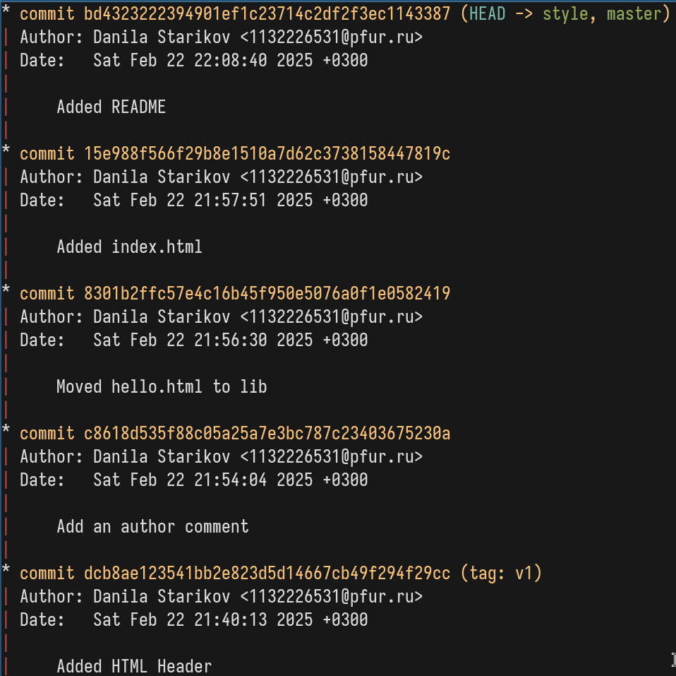

---
## Front matter
title: "Отчет по лабораторной работе №1"
subtitle: "Работа с git."
author: "Данила Андреевич Стариков"

## Generic otions
lang: ru-RU
toc-title: "Содержание"

## Bibliography
bibliography: bib/cite.bib
csl: pandoc/csl/gost-r-7-0-5-2008-numeric.csl

## Pdf output format
toc: true # Table of contents
toc-depth: 2
lof: true # List of figures
lot: true # List of tables
fontsize: 12pt
linestretch: 1.5
papersize: a4
documentclass: scrreprt
## I18n polyglossia
polyglossia-lang:
  name: russian
  options:
	- spelling=modern
	- babelshorthands=true
polyglossia-otherlangs:
  name: english
## I18n babel
babel-lang: russian
babel-otherlangs: english
## Fonts
mainfont: IBM Plex Serif
romanfont: IBM Plex Serif
sansfont: IBM Plex Sans
monofont: IBM Plex Mono
mathfont: STIX Two Math
mainfontoptions: Ligatures=Common,Ligatures=TeX,Scale=0.94
romanfontoptions: Ligatures=Common,Ligatures=TeX,Scale=0.94
sansfontoptions: Ligatures=Common,Ligatures=TeX,Scale=MatchLowercase,Scale=0.94
monofontoptions: Scale=MatchLowercase,Scale=0.94,FakeStretch=0.9
mathfontoptions:
## Biblatex
biblatex: true
biblio-style: "gost-numeric"
biblatexoptions:
  - parentracker=true
  - backend=biber
  - hyperref=auto
  - language=auto
  - autolang=other*
  - citestyle=gost-numeric
## Pandoc-crossref LaTeX customization
figureTitle: "Рис."
tableTitle: "Таблица"
listingTitle: "Листинг"
lofTitle: "Список иллюстраций"
lotTitle: "Список таблиц"
lolTitle: "Листинги"
## Misc options
indent: true
header-includes:
  - \usepackage{indentfirst}
  - \usepackage{float} # keep figures where there are in the text
  - \floatplacement{figure}{H} # keep figures where there are in the text
---

# Цель работы

Познакомиться с системой контроля версий git, выполнить базовые команды по созданию, изменению и управлению локальными репозиториями git.

# Выполнение лабораторной работы

{#fig:1 width=70%}

{#fig:2 width=70%}

{#fig:3 width=70%}

{#fig:4 width=70%}

{#fig:5 width=70%}

{#fig:6 width=70%}

{#fig:7 width=70%}

{#fig:8 width=70%}

{#fig:9 width=70%}

{#fig:10 width=70%}

{#fig:11 width=70%}

{#fig:12 width=70%}

{#fig:13 width=70%}

{#fig:14 width=70%}

{#fig:15 width=70%}

{#fig:16 width=70%}

{#fig:17 width=70%}

{#fig:18 width=70%}

{#fig:19 width=70%}

{#fig:20 width=70%}

{#fig:21 width=70%}

{#fig:22 width=70%}

{#fig:23 width=70%}

{#fig:24 width=70%}

{#fig:25 width=70%}

{#fig:26 width=70%}

{#fig:28 width=70%}

{#fig:29 width=70%}

{#fig:30 width=70%}

{#fig:31 width=70%}

{#fig:32 width=70%}

{#fig:33 width=70%}

{#fig:34 width=70%}

{#fig:35 width=70%}

{#fig:36 width=70%}

{#fig:37 width=70%}

{#fig:38 width=70%}

{#fig:39 width=70%}

{#fig:40 width=70%}

{#fig:41 width=70%}

{#fig:42 width=70%}

{#fig:43 width=70%}

{#fig:44 width=70%}

{#fig:45 width=70%}

{#fig:46 width=70%}

{#fig:47 width=70%}

{#fig:48 width=70%}

{#fig:49 width=70%}

{#fig:50 width=70%}

{#fig:51 width=70%}

{#fig:52 width=70%}

{#fig:53 width=70%}

{#fig:54 width=70%}

# Выводы

В результате выполнения лабораторной работы познакомились с основными функциями системы контроля версий git.
