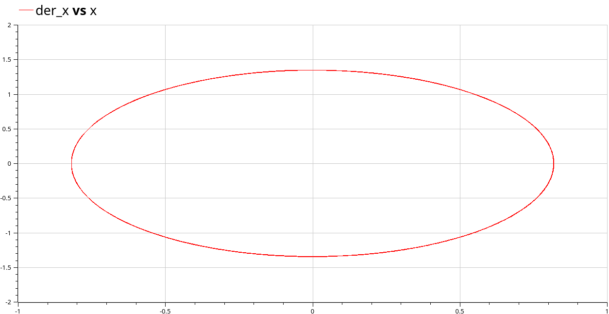
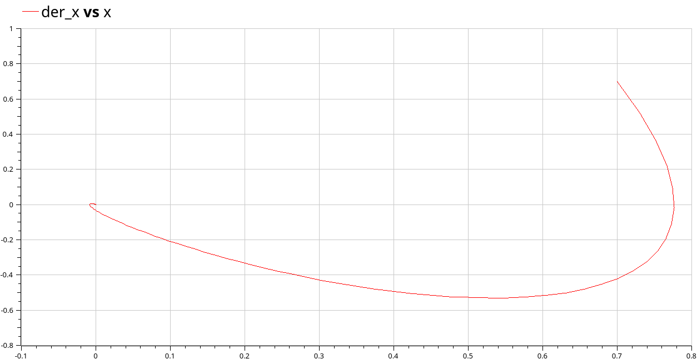
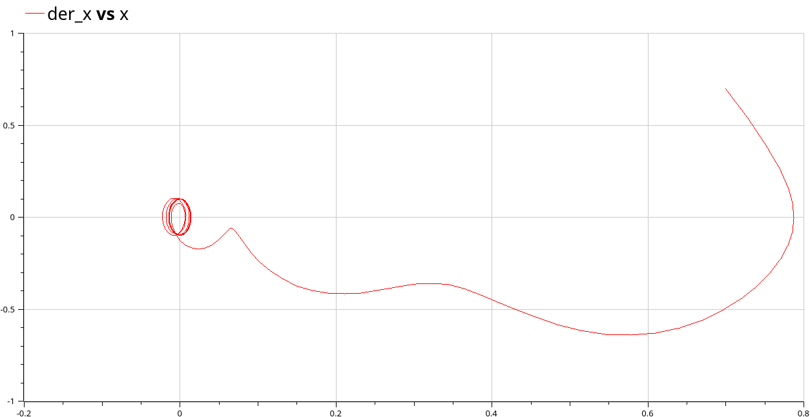

---
## Front matter
lang: ru-RU
title: Лабораторная работа №4.
subtitle: Модель гармонических колебаний
author:
  - Стариков Д. А.
institute:
  - Российский университет дружбы народов, Москва, Россия
date: 05 апреля 2025

## i18n babel
babel-lang: russian
babel-otherlangs: english

## Formatting pdf
toc: false
toc-title: Содержание
slide_level: 2
aspectratio: 169
section-titles: true
theme: metropolis
header-includes:
 - \metroset{progressbar=frametitle,sectionpage=progressbar,numbering=fraction}
---


# Вводная часть

## Цели и задачи

1. Построить решение уравнения гармонического осциллятора без затухания 
2. Записать уравнение свободных колебаний гармонического осциллятора с
затуханием, построить его решение. Построить фазовый портрет гармонических
колебаний с затуханием.
3. Записать уравнение колебаний гармонического осциллятора, если на систему
действует внешняя сила, построить его решение. Построить фазовый портрет
колебаний с действием внешней силы.

## Цели и задачи

*Вариант № 52*

Построить фазовый портрет гармонического осциллятора и решение уравнения
гармонического осциллятора для следующих случаев:

1. Колебания гармонического осциллятора без затуханий и без действий внешней
силы
$$ \ddot{x} + 2.7x = 0$$
2. Колебания гармонического осциллятора c затуханием и без действий внешней
силы
$$ \ddot{x} + 2.7\dot{x} + 2.7x = 0$$
3. Колебания гармонического осциллятора c затуханием и под действием внешней
силы
$$ \ddot{x} + 17\dot{x} + 2.7x = 0.7\sin{(7t)}$$
На интервалеx $t \in [0;47]$ (шаг 0.05) с начальными условиями $x_0 = 0.7, y_0 = 0.7$

# Результаты

## Колебания гармонического осциллятора без затуханий и без действий внешней силы

Уравнение гармонических колебаний гармонического осциллятора без затуханий и без действий внешней силы имеет следующий вид:

$$ \ddot{x} + \omega^2x = 0$$

## Колебания гармонического осциллятора без затуханий и без действий внешней силы

```
model lab04
  parameter Real gamma = 0;
  parameter Real omega_2 = 2.7;
  Real f = 0;
  Real x; Real der_x;
initial equation
  x=0.7; der_x=0.7;
equation
  der_x = der(x);
  der(der_x) + gamma*der_x + omega_2*x = f;
annotation(
    experiment(StartTime = 0, StopTime = 47, Tolerance = 1e-06, Interval = 0.05));
end lab04;
```
## Колебания гармонического осциллятора без затуханий и без действий внешней силы

{#fig:001 width=70%}


## Колебания гармонического осциллятора c затуханий и без действий внешней силы

Уравнение гармонических колебаний гармонического осциллятора c затуханием и без действий внешней силы имеет следующий вид:

$$ \ddot{x} + \gamma \dot{x} + \omega^2x = 0$$

## Колебания гармонического осциллятора c затуханий и без действий внешней силы

```
model lab04
  parameter Real gamma = 2.7;
  parameter Real omega_2 = 2.7;
  Real f = 0;
  Real x; Real der_x;
initial equation
  x=0.7; der_x=0.7;
equation
  der_x = der(x);
  der(der_x) + gamma*der_x + omega_2*x = f;
annotation(
    experiment(StartTime = 0, StopTime = 47, Tolerance = 1e-06, Interval = 0.05));
end lab04;
```

## Колебания гармонического осциллятора c затуханий и без действий внешней силы

{#fig:002 width=70%}

## Колебания гармонического осциллятора с затуханий и под действием внешней силы

Уравнение гармонических колебаний гармонического осциллятора с затуханий и под действием внешней силы имеет следующий вид:

$$ \ddot{x} + 2\gamma \dot{x} + \omega^2x = f(t)$$

## Колебания гармонического осциллятора с затуханий и под действием внешней силы

```
model lab04
  parameter Real gamma = 0;
  parameter Real omega_2 = 2.7;
  Real f = 2.7*sin(7*time);
  Real x; Real der_x;
initial equation
  x=0.7; der_x=0.7;
equation
  der_x = der(x);
  der(der_x) + gamma*der_x + omega_2*x = f;
annotation(
    experiment(StartTime = 0, StopTime = 47, Tolerance = 1e-06, Interval = 0.05));
end lab04;
```

## Колебания гармонического осциллятора с затуханий и под действием внешней силы

{#fig:003 width=70%}

# Выводы

- Познакомились с моделью гармонических колебаний 
- Исследовали модели:
  - Колебания гармонического осциллятора без затуханий и без действий внешней силы
  - Колебания гармонического осциллятора c затуханий и без действий внешней силы
  - Колебания гармонического осциллятора с затуханий и под действием внешней силы
