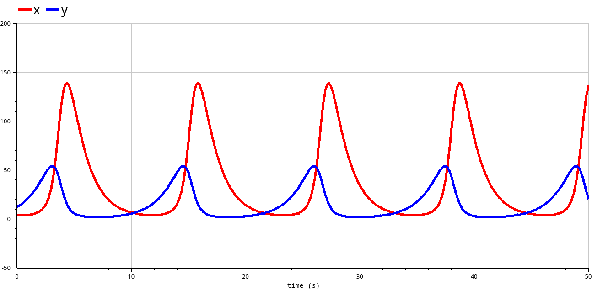
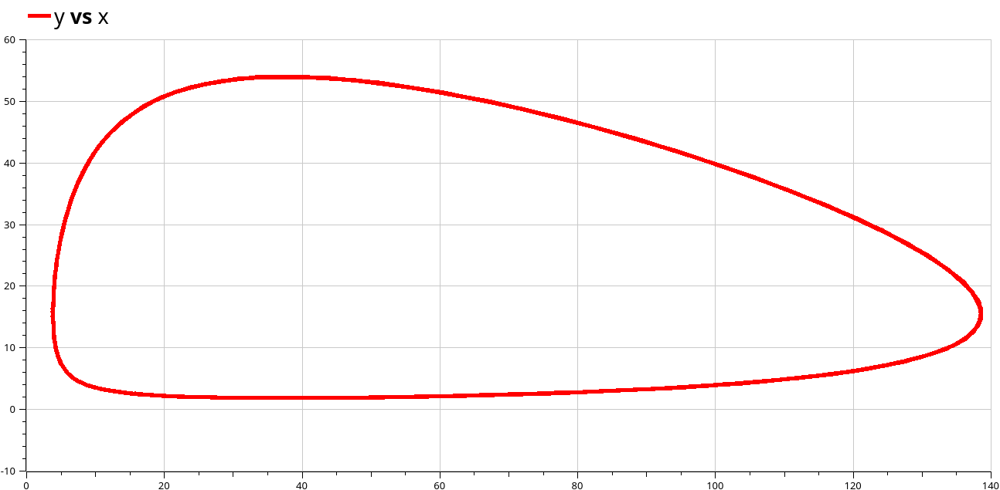
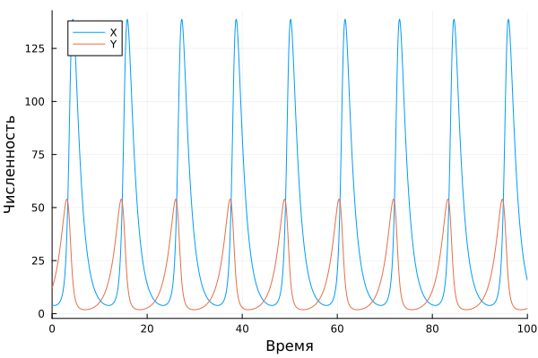
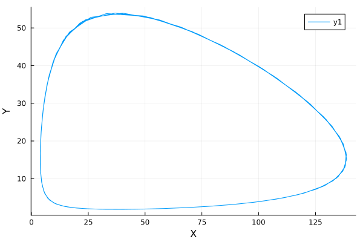

---
## Front matter
lang: ru-RU
title: Лабораторная работа №5
subtitle: Модель хищник-жертва
author:
  - Стариков Д. А.
institute:
  - Российский университет дружбы народов, Москва, Россия
date: 19 апреля 2025

## i18n babel
babel-lang: russian
babel-otherlangs: english

## Formatting pdf
toc: false
toc-title: Содержание
slide_level: 2
aspectratio: 169
section-titles: true
theme: metropolis
header-includes:
 - \metroset{progressbar=frametitle,sectionpage=progressbar,numbering=fraction}
---


# Цель работы

Реализовать модель хищник-жертва в OpenModelica и Julia, построить графики зависимости x и y от времени, график зависимости x от y.

# Задание
Вариант 50

Для модели «хищник-жертва»:

$$
    \begin{cases}
	\dfrac{dx}{dt} = -0.71x(t)+0.046x(t)y(t),\\
	\dfrac{dy}{dt} = 0.64y(t)-0.017x(t)y(t).
    \end{cases}\,.
$$

Постройте график зависимости численности хищников от численности жертв,
а также графики изменения численности хищников и численности жертв при
следующих начальных условиях: $x_0=4, y_0=12$. Найдите стационарное состояние системы.

# Выполнение работы

## Моделирование в OpenModelica

```
model lab05 // Lotka-Volterra
    parameter Real a=-0.71;
  parameter Real b=0.046;
  parameter Real c=0.64;
  parameter Real d=-0.017;
  parameter Real x0=4;
  parameter Real y0=12;
  Real x(start=x0);
  Real y(start=y0);
  equation 
  der(x) = a*x+b*x*y;
  der(y) = c*y+d*x*y;
annotation(experiment(StartTime = 0, StopTime = 10, Interval = 0.002));
end lab05;
```

## Моделирование в OpenModelica

{#fig:001 width=70%}

## Моделирование в OpenModelica

{#fig:002 width=70%}

Также найдено стационарное состояние системы по формуле $x_s=\dfrac{c}{d}=-37.6470, y_s=\dfrac{a}{b}=-15.4347$


## Моделирование в Julia

```
using OrdinaryDiffEq, Plots
function model(u, p, t)
    x, y = u
    a, b, c, d = p
    dx = a*x + b*x*y
    dy = c*y + d*x*y
    return [dx, dy]
end
u0 = [4,12]
p = [-0.71, 0.046, 0.64, -0.017]
t = (0,100)
prob = ODEProblem(model, u0, t, p)
sol = solve(prob, reltol = 1e-12)
plot(sol, label=["X" "Y"], xaxis="Время", yaxis="Численность")
plot(map(first, sol.u), map(last, sol.u), xaxis="X", yaxis="Y")
```
## Моделирование в Julia

{#fig:003 width=70%}

## Моделирование в Julia

{#fig:004 width=70%}


# Выводы

* В результате выполнения лабораторной работы провели численное моделирование модели хишник-жертва в `OpenModelica` и `Julia`.
