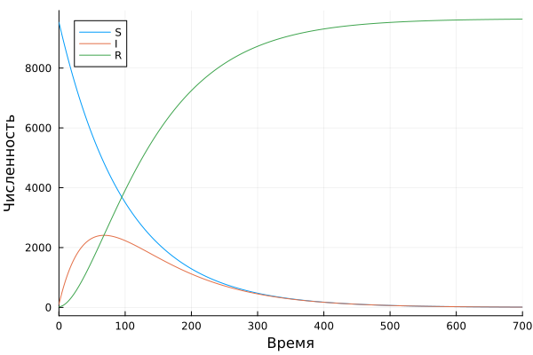

---
## Front matter
lang: ru-RU
title: Лабораторная работа №6
subtitle: Модель эпидемии
author:
  - Стариков Д. А.
institute:
  - Российский университет дружбы народов, Москва, Россия
date: 03 мая 2025

## i18n babel
babel-lang: russian
babel-otherlangs: english

## Formatting pdf
toc: false
toc-title: Содержание
slide_level: 2
aspectratio: 169
section-titles: true
theme: metropolis
header-includes:
 - \metroset{progressbar=frametitle,sectionpage=progressbar,numbering=fraction}
---

## Цель работы

Реализовать модель эпидемии в OpenModelica и Julia, построить графики зависимости числа особей из трех групп, рассмотреть 2 случая:

* если $I(0) > I^*$
* если $I(0) \le I^*$

## Задание
Вариант 52.

На одном острове вспыхнула эпидемия. Известно, что из всех проживающих
на острове (N=9654) в момент начала эпидемии (t=0) число заболевших людей
(являющихся распространителями инфекции) I(0)=100, А число здоровых людей с
иммунитетом к болезни R(0)=20. Таким образом, число людей восприимчивых к
болезни, но пока здоровых, в начальный момент времени S(0)=N-I(0)- R(0).

Постройте графики изменения числа особей в каждой из трех групп.

Рассмотрите, как будет протекать эпидемия в случае:

* если $I(0) > I^*$
* если $I(0) \le I^*$


## Моделирование в OpenModelica

Модель эпидемии в `OpenModelica` реализована следующим образом:

\tiny
```
model lab06 // SIR
  parameter Real alpha=0.02;
  parameter Real beta=0.01;
  parameter Real I0=100;
  parameter Real R0=20;
  parameter Real S0=9654-I0-R0;
  
  Real S(start=S0);
  Real I(start=I0);
  Real R(start=R0);
equation 
  // случай I0 > I*
  //der(S) = -alpha*S;
  //der(I) = alpha*S - beta*I;
  // случай I0 <= I*
  der(S) = 0;
  der(I) = -beta*I;
  der(R) = beta*I;
annotation(
    experiment(StartTime = 0, StopTime = 700, Interval = 0.01));
end lab06;
```

## Моделирование в OpenModelica

  * Случай $I(0) > I^*$:

{#fig:001 width=70%}

## Моделирование в OpenModelica

* Случай $I(0) \le I^*$: 
  
{#fig:002 width=70%}

## Моделирование в Julia


Модель эпидемии в `Julia` реализована следующим образом:

\tiny
:::::::::::::: {.columns}
::: {.column}
```julia
using OrdinaryDiffEq, Plots
function model1(u, p, t)
    # SIR with I0>I*
    S, I, R = u
    alpha, beta = p
    dS = -alpha*S
    dI = alpha*S-beta*I
    dR = beta*I
    return [dS, dI, dR]
end
function model2(u, p, t)
    # SIR with I0<=I*
    S, I, R = u
    alpha, beta = p
    dS = 0
    dI = -beta*I
    dR = beta*I
    return [dS, dI, dR]
end
```
:::
::: {.column}
```julia
I0 = 100
R0 = 20
S0 = 9654 - I0 - R0
u0 = [S0, I0, R0]
p = [0.01, 0.02]
t = (0,700)
prob1 = ODEProblem(model1, u0, t, p)
prob2 = ODEProblem(model2, u0, t, p)
sol1 = solve(prob1)
sol2 = solve(prob2)
plot(sol1, label=["S" "I" "R"], xaxis="Время", yaxis="Численность")
plot(sol2, label=["S" "I" "R"], xaxis="Время", yaxis="Численность")
```
:::
::::::::::::::

## Моделирование в Julia

  * Случай $I(0) > I^*$: 

{#fig:003 width=70%}

## Моделирование в Julia

  * Случай $I(0) \le I^*$: 

{#fig:004 width=70%}


## Выводы

* В ходе выполнения лабораторной работы познакомились с моделью эпидемии (SIR) и на конкретном примере рассмотрели случаи, когда начальное число зараженных особей больше или меньше критического значения.


