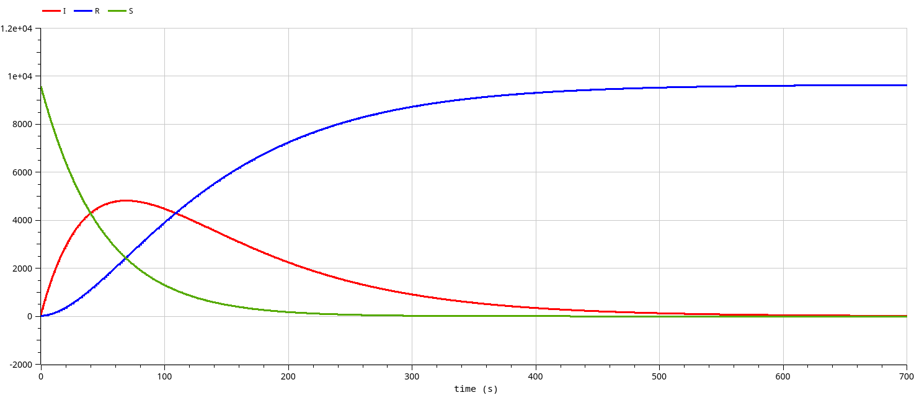
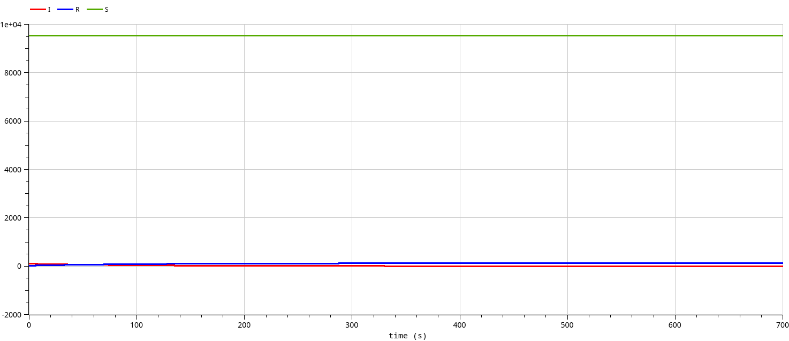
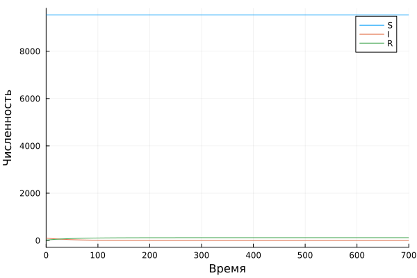

---
## Front matter
title: "Отчет по лабораторной работе №6"
subtitle: "Модель эпидемии"
author: "Данила Андреевич Стариков"

## Generic otions
lang: ru-RU
toc-title: "Содержание"

## Bibliography
bibliography: bib/cite.bib
csl: pandoc/csl/gost-r-7-0-5-2008-numeric.csl

## Pdf output format
toc: true # Table of contents
toc-depth: 2
lof: false # List of figures
lot: false # List of tables
fontsize: 12pt
linestretch: 1.5
papersize: a4
documentclass: scrreprt
## I18n polyglossia
polyglossia-lang:
  name: russian
  options:
	- spelling=modern
	- babelshorthands=true
polyglossia-otherlangs:
  name: english
## I18n babel
babel-lang: russian
babel-otherlangs: english
## Fonts
mainfont: IBM Plex Serif
romanfont: IBM Plex Serif
sansfont: IBM Plex Sans
monofont: IBM Plex Mono
mathfont: STIX Two Math
mainfontoptions: Ligatures=Common,Ligatures=TeX,Scale=0.94
romanfontoptions: Ligatures=Common,Ligatures=TeX,Scale=0.94
sansfontoptions: Ligatures=Common,Ligatures=TeX,Scale=MatchLowercase,Scale=0.94
monofontoptions: Scale=MatchLowercase,Scale=0.94,FakeStretch=0.9
mathfontoptions:
## Biblatex
biblatex: true
biblio-style: "gost-numeric"
biblatexoptions:
  - parentracker=true
  - backend=biber
  - hyperref=auto
  - language=auto
  - autolang=other*
  - citestyle=gost-numeric
## Pandoc-crossref LaTeX customization
figureTitle: "Рис."
tableTitle: "Таблица"
listingTitle: "Листинг"
lofTitle: "Список иллюстраций"
lotTitle: "Список таблиц"
lolTitle: "Листинги"
## Misc options
indent: true
header-includes:
  - \usepackage{indentfirst}
  - \usepackage{float} # keep figures where there are in the text
  - \floatplacement{figure}{H} # keep figures where there are in the text
---

# Цель работы

Реализовать модель эпидемии в OpenModelica и Julia, построить графики зависимости числа особей из трех групп, рассмотреть 2 случая:

* если $I(0) > I^*$
* если $I(0) \le I^*$

# Задание
Вариант 52.

На одном острове вспыхнула эпидемия. Известно, что из всех проживающих
на острове (N=9654) в момент начала эпидемии (t=0) число заболевших людей
(являющихся распространителями инфекции) I(0)=100, А число здоровых людей с
иммунитетом к болезни R(0)=20. Таким образом, число людей восприимчивых к
болезни, но пока здоровых, в начальный момент времени S(0)=N-I(0)- R(0).

Постройте графики изменения числа особей в каждой из трех групп.

Рассмотрите, как будет протекать эпидемия в случае:
  * если $I(0) > I^*$
  * если $I(0) \le I^*$

# Выполнение лабораторной работы

Описываются проведённые действия, в качестве иллюстрации даётся ссылка на иллюстрацию (рис. [-@fig:001]).

## Моделирование в OpenModelica

Модель эпидемии в `OpenModelica` реализована следующим образом:

```
model lab06 // SIR
  parameter Real alpha=0.02;
  parameter Real beta=0.01;
  parameter Real I0=100;
  parameter Real R0=20;
  parameter Real S0=9654-I0-R0;
  
  Real S(start=S0);
  Real I(start=I0);
  Real R(start=R0);
equation 
  // случай I0 > I*
  //der(S) = -alpha*S;
  //der(I) = alpha*S - beta*I;
  // случай I0 <= I*
  der(S) = 0;
  der(I) = -beta*I;
  der(R) = beta*I;
annotation(
    experiment(StartTime = 0, StopTime = 700, Interval = 0.01));
end lab06;
```

  * В случае, когда начальное число инфицированных больше критического значения ($I(0) > I^*$), изменение числа особей выглядит следующим образом:
  
{#fig:001 width=70%}

  * В случае, когда начальное число инфицированных меньше или равно критическому значению ($I(0) \le I^*$), изменение числа особей выглядит следующим образом:
  
{#fig:002 width=70%}


## Моделирование в Julia


Модель эпидемии в `Julia` реализована следующим образом:

```julia
```

  * В случае, когда начальное число инфицированных больше критического значения ($I(0) > I^*$), изменение числа особей выглядит следующим образом:
  
{#fig:003 width=70%}

  * В случае, когда начальное число инфицированных меньше или равно критическому значению ($I(0) \le I^*$), изменение числа особей выглядит следующим образом:
  
{#fig:004 width=70%}


# Выводы

В ходе выполнения лабораторной работы познакомились с моделью эпидемии (SIR) и на конкретном примере рассмотрели случаи, когда начальное число зараженных особей больше или меньше критического значения.
