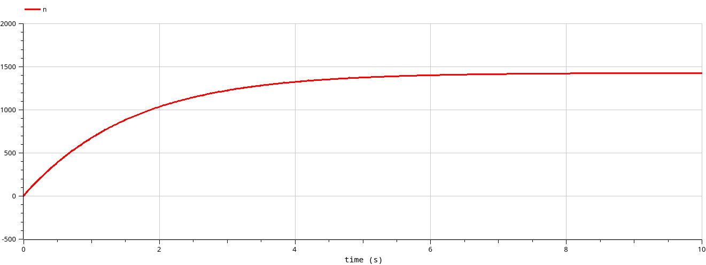
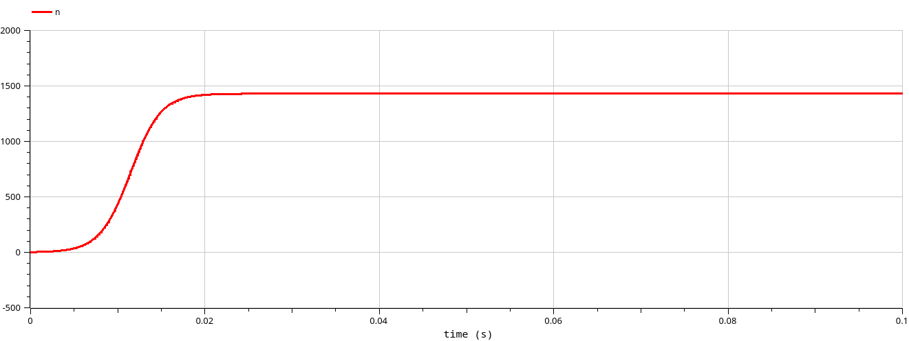
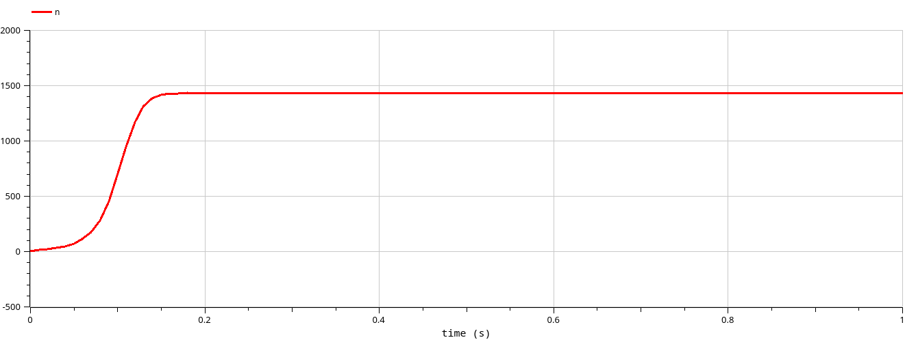
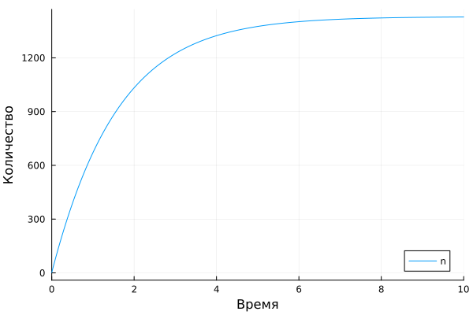
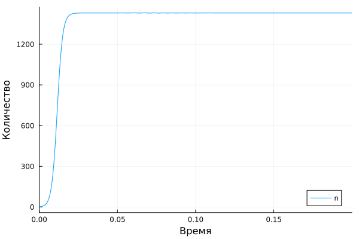
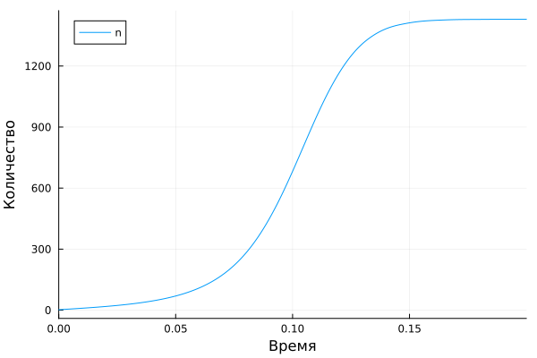

---
## Front matter
title: "Отчет по лабораторной работе №7"
subtitle: "Модель рекламной кампании"
author: "Данила Андреевич Стариков"

## Generic otions
lang: ru-RU
toc-title: "Содержание"

## Bibliography
bibliography: bib/cite.bib
csl: pandoc/csl/gost-r-7-0-5-2008-numeric.csl

## Pdf output format
toc: true # Table of contents
toc-depth: 2
lof: false # List of figures
lot: false # List of tables
fontsize: 12pt
linestretch: 1.5
papersize: a4
documentclass: scrreprt
## I18n polyglossia
polyglossia-lang:
  name: russian
  options:
	- spelling=modern
	- babelshorthands=true
polyglossia-otherlangs:
  name: english
## I18n babel
babel-lang: russian
babel-otherlangs: english
## Fonts
mainfont: IBM Plex Serif
romanfont: IBM Plex Serif
sansfont: IBM Plex Sans
monofont: IBM Plex Mono
mathfont: STIX Two Math
mainfontoptions: Ligatures=Common,Ligatures=TeX,Scale=0.94
romanfontoptions: Ligatures=Common,Ligatures=TeX,Scale=0.94
sansfontoptions: Ligatures=Common,Ligatures=TeX,Scale=MatchLowercase,Scale=0.94
monofontoptions: Scale=MatchLowercase,Scale=0.94,FakeStretch=0.9
mathfontoptions:
## Biblatex
biblatex: true
biblio-style: "gost-numeric"
biblatexoptions:
  - parentracker=true
  - backend=biber
  - hyperref=auto
  - language=auto
  - autolang=other*
  - citestyle=gost-numeric
## Pandoc-crossref LaTeX customization
figureTitle: "Рис."
tableTitle: "Таблица"
listingTitle: "Листинг"
lofTitle: "Список иллюстраций"
lotTitle: "Список таблиц"
lolTitle: "Листинги"
## Misc options
indent: true
header-includes:
  - \usepackage{indentfirst}
  - \usepackage{float} # keep figures where there are in the text
  - \floatplacement{figure}{H} # keep figures where there are in the text
---

# Цель работы

Реализовать модель рекламной кампании в OpenModelica и Julia, сравнить 3 случая:

* если $\alpha_1 \gg \alpha_2$
* если $\alpha_1 \ll \alpha_2$
* если $\alpha_1 \approx \alpha_2$

# Задание
Вариант 52.

Постройте график распространения рекламы, математическая модель которой описывается
следующим уравнением:

1. $\dfrac{dn}{dt} = (0.62+0.000023n(t))(N-n(t))$

1. $\dfrac{dn}{dt} = (0.000024+0.4n(t))(N-n(t))$

1. $\dfrac{dn}{dt} = (0.5+0.5tn(t))(N-n(t))$

При этом объем аудитории $N=1430$, в начальный момент о товаре знает 11 человек. Для
случая 2 определите в какой момент времени скорость распространения рекламы будет
иметь максимальное значение.

# Выполнение лабораторной работы

## Моделирование в OpenModelica

Модель рекламной кампании в `OpenModelica` реализована следующим образом:

```
model lab07 // Эффективность рекламы
  Real a1; // платная реклама
  Real a2; // сарафанное радио
  parameter Real N=1430.;
  parameter Real N0=2.;
  Real n(start=N0);
equation
  der(n) = (a1 + a2*n)*(N-n);
// уравнение 1
  a1 = 0.62;
  a2 = 0.000032;
// уравнение 2
//  a1 = 0.000024;
//  a2 = 0.4;
// уравнение 3
//  a1 = 0.5;
//  a2 = 0.5*time;
annotation(
    experiment(StartTime = 0, StopTime = 0.5, Interval=1e-4));
end lab07;
```
 
{#fig:001 width=70%}
  
{#fig:002 width=70%}

{#fig:003 width=70%}

Для случая 2 ($\alpha_1 \ll \alpha_2$) в момент времени $t=0.0115$ скорость распространения рекламы была максимальна и равнялась $\dfrac{dn}{t}=204487.39723129466$

## Моделирование в Julia

Модель эпидемии в `Julia` реализована следующим образом:

```julia
using OrdinaryDiffEq, Plots
function model(u, p, t)
    N = 1430
    n = u
    a1, a2 = p
    dn = (a1 + a2*n)*(N-n)
    return dn
end
u0 = 2.
p1 = [0.62, 0.000032] # [a1, a2]
t = (0,10)
# уравнение 1
prob1 = ODEProblem(model, u0, t, p1)
sol1 = solve(prob1)
plot(sol1, label="n", xaxis="Время", yaxis="Количество")
savefig("/home/dastarikov/work/study/2024-2025/study_2024-2025_mathmod/labs/lab7\
/report/image/jl_1.png")
# уравнение 2
p2 = [0.000024, 0.4]
t = (0,.2)
prob2 = ODEProblem(model, u0, t, p2)
sol2 = solve(prob2)
plot(sol2, label="n", xaxis="Время", yaxis="Количество")
savefig("/home/dastarikov/work/study/2024-2025/study_2024-2025_mathmod/labs/lab7\
/report/image/jl_2.png")
# уравнение 3
function model2(u, p, t)
    # eq1
    N = 1430
    n = u
    a1, a2 = p
    dn = (a1 + a2*t*n)*(N-n)
    return dn
end
p3 = [0.5, 0.5]
t = (0,.2)
prob3 = ODEProblem(model2, u0, t, p3)
sol3 = solve(prob3)
plot(sol3, label="n", xaxis="Время", yaxis="Количество")
savefig("/home/dastarikov/work/study/2024-2025/study_2024-2025_mathmod/labs/lab7\
/report/image/jl_3.png")
```

{#fig:004 width=70%}
  
{#fig:005 width=70%}

{#fig:006 width=70%}
  
# Выводы

В ходе выполнения лабораторной работы познакомились с моделью рекламной кампании и на конкретном примере рассмотрели влияние платной рекламы и сарафанное радио на распространение информации.
