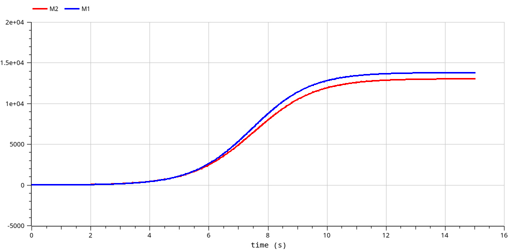
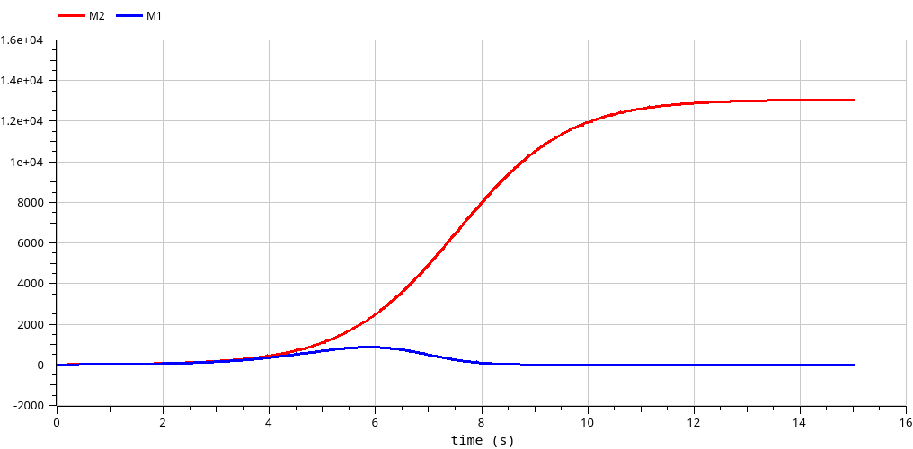

---
## Front matter
lang: ru-RU
title: Лабораторная работа №8
subtitle: Модель конкуренции двух фирм
author:
  - Стариков Д. С.
institute:
  - Российский университет дружбы народов, Москва, Россия
date: 31 мая 2025

## i18n babel
babel-lang: russian
babel-otherlangs: english

## Formatting pdf
toc: false
toc-title: Содержание
slide_level: 2
aspectratio: 169
section-titles: true
theme: metropolis
header-includes:
 - \metroset{progressbar=frametitle,sectionpage=progressbar,numbering=fraction}
---

## Цель работы

Изучить модель конкуренции двух фирм, производящих взаимозаменяемые товары
одинакового качества и находящихся в одной рыночной нише, и рассмотреть 2 случая: 

* борьба ведется только рыночными методами
* помимо экономического фактора влияния  используются еще и социально-психологические факторы – формирование общественного предпочтения одного товара другому, не зависимо от их качества и цены.

## Задание
Вариант 52.

Для первого случая (только рыночная борьба):

$\frac{dM_1}{d\theta} = M_1 - \frac{b}{c_1} M_1 M_2 - \frac{a_1}{c_1} M_1^2,$

$\frac{dM_2}{d\theta} = \frac{c_2}{c_1} M_2 - \frac{b}{c_1} M_1 M_2 - \frac{a_2}{c_1} M_2^2,$

где $a_1 = \frac{p_{cr}}{\tau_1^2 \tilde{p}_1^2 Nq}$, $a_2 = \frac{p_{cr}}{\tau_2^2 \tilde{p}_2^2 Nq}$, $b = \frac{p_{cr}}{\tau_1^2 \tilde{p}_1^2 \tau_2^2 \tilde{p}_2^2 Nq}$, $c_1 = \frac{p_{cr} - \tilde{p}_1}{\tau_1 \tilde{p}_1}$, $c_1 = \frac{p_{cr} - \tilde{p}_1}{\tau_1 \tilde{p}_1}$,$c_2 = \frac{p_{cr} - \tilde{p}_2}{\tau_2 \tilde{p}_2}$

Во втором случае (формирование общественного предпочтения):

$\frac{dM_1}{d\theta} = M_1 - (\frac{b}{c_1}+0.00042) M_1 M_2 - \frac{a_1}{c_1} M_1^2,$

$\frac{dM_2}{d\theta} = \frac{c_2}{c_1} M_2 - \frac{b}{c_1} M_1 M_2 - \frac{a_2}{c_1} M_2^2.$

$M_1^0=7.9, M_2^0=9.9, p_{cr}=49, N=50, q=1, \tau_1=35, \tau_2=29, \tilde{p}_1=9.9, \tilde{p}_2=11.9$

## Моделирование в OpenModelica

Модель рекламной кампании в `OpenModelica` реализована следующим образом:

\tiny
```
model lab08
parameter Real p_cr=49;
parameter Real p1=9.9;
parameter Real p2=11.9;
parameter Real tau1=35;
parameter Real tau2=29;
parameter Real N=50;
parameter Real q=1;
parameter Real a1=p_cr/(tau1*tau1*p1*p1*N*q);
parameter Real a2=p_cr/(tau2*tau2*p2*p2*N*q);
parameter Real b=p_cr/(tau1*tau1*p1*p1*tau2*tau2*p2*p2*N*q);
parameter Real c1=(p_cr-p1)/(tau1*p1);
parameter Real c2=(p_cr-p2)/(tau2*p2);
Real M1(start=7.9);
Real M2(start=9.9);
//parameter Real eps=0; // случай 1
parameter Real eps=0.00042; // случай 2
equation

der(M1) = M1 - (b/c1+eps)*M1*M2 - a1/c1*M1*M1;
der(M2) = c2/c1*M2 - b/c1*M1*M2 - a2/c1*M2*M2;
annotation(
    experiment(StartTime = 0, StopTime = 15));
end lab08;
```
 
## Моделирование в OpenModelica

{#fig:001 width=70%}
  
## Моделирование в OpenModelica	

{#fig:002 width=70%}
  
## Выводы

В ходе выполнения лабораторной работы познакомились с моделью конкуренции двух фирм и на конкретном примере рассмотрели влияние общественного предпочтения на оборот компании.
